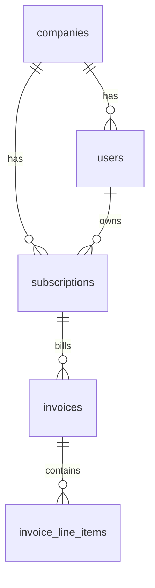

# synthetic-data-forge

[](https://github.com/thiagoger/synthetic-data-forge/actions/workflows/ci.yml)
[](https://www.python.org)
[](LICENSE)
[](pyproject.toml)

**Fake data that doesn't fall apart.** One command gives you a whole business worth of records where every invoice points at a customer that actually exists, every total adds up, and re-running it tomorrow gives you the exact same database.

```console
$ synthetic-forge --companies 8 --months 18 --seed 42 --validate-only

Row counts:
  companies                     8
  users                       129
  subscriptions                 8
  invoices                    144
  invoice_line_items          276

Referential integrity: PASS (0 dangling references)
```

That `PASS` is the whole point. I spent two years building demo environments for SaaS products, and the thing that always broke them was data that *looked* real but wasn't wired together: orphan foreign keys, invoice totals that didn't match their line items, a different dataset every time you re-seeded. This is the small, open distillation of how I solved it.

## What you get

Five connected tables, generated as one graph so the relationships hold by construction:



- **Integrity is built in, then checked again.** Children are only ever attached to parents that already exist, and a validator re-walks the whole graph at the end so a bad dataset can never leave the door.
- **Same seed, same bytes.** Output is a pure function of the seed. Your demo looks identical on your laptop, in CI, and on the reviewer's machine.
- **Totals reconcile.** Every invoice equals the sum of its line items, down to the cent.
- **Nothing to install.** Standard library only. `git clone` and run.

## Run it

```bash
pip install git+https://github.com/thiagoger/synthetic-data-forge.git

synthetic-forge --companies 50 --months 24 --seed 7 --out ./out --format csv   # CSV files
synthetic-forge --validate-only                                                # just the integrity report
```

Or pull it into your own code:

```python
from synthetic_forge import DatasetSpec, generate, validate_integrity

data = generate(DatasetSpec(companies=50, months_of_history=24, seed=7))
assert validate_integrity(data).ok
invoices = data["invoices"]   # list[dict]; every company_id resolves
```

## Want to extend it?

The generator only needs callables that return strings, so swapping the built-in name pools for [Faker](https://faker.readthedocs.io/) is a two-line change. Adding a table means adding one entry to the foreign-key map in `validate.py` so the integrity check covers it too.

## Tests

`pytest -q` runs the suite: determinism, foreign-key integrity, invoice/line-item reconciliation, and orphan detection. CI runs it on Python 3.10 through 3.13 on every push.

## License

MIT. Use it for anything.
